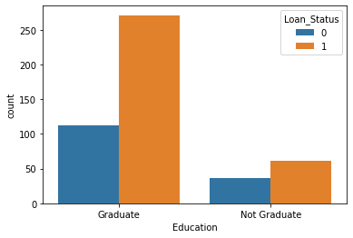
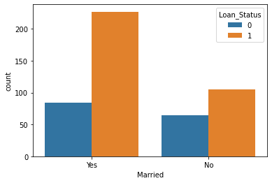

# **Loan Status Prediction**

## Introduction
This project aims to predict the loan approval status based on various applicant attributes using a Support Vector Classifier model. The dataset includes various features such as gender, education, and employment status. The goal is to build a predictive model that can classify loan applications as approved or denied.

## Background
Loan approval is a critical process for financial institutions, involving the assessment of multiple factors to determine the eligibility of applicants. This project explores how different applicant characteristics impact loan approval using a Support Vector Classifier model. By analyzing the dataset, the model aims to provide insights into the key factors that influence loan approval decisions.

## Dataset
The [dataset](/train_u6lujuX_CVtuZ9i%20(1).csv) used for this project contains information about loan applicants, including personal and financial details. The primary columns include:

- `Loan_ID`: Unique identifier for each loan application
- `Gender`: Gender of the applicant
- `Married`: Marital status of the applicant
- `Dependents`: Number of dependents
- `Education`: Education level
- `Self_Employed`: Employment status
- `Property_Area`: Area of residence
- `Loan_Status`: Target variable indicating loan approval status

## Tools I Used
- **Python**: For data analysis and machine learning model development.
- **Scikit-learn**: To build and evaluate the Support Vector Classifier model.
- **Seaborn & Matplotlib**: For data visualization.
- **Pandas**: For data manipulation and cleaning.

## The Analysis
### Data Preprocessing
1. **Handling Missing Values**: Missing values were removed from the dataset to ensure the accuracy of the analysis.
2. **Handling Categorical Variables**: Categorical variables were converted to numerical values to be used in the model.

```python
df.loc[:, 'Loan_Status'] = df['Loan_Status'].replace({'Y': 1, 'N': 0})
df["Dependents"].replace({'3+': 4}, inplace=True)
df.replace({"Gender": {"Male": 1, "Female": 0},
            "Married": {"Yes": 1, "No": 0},
            "Education": {"Graduate": 1, "Not Graduate": 0},
            "Self_Employed": {"No": 0, "Yes": 1},
            "Property_Area": {"Urban": 2, "Semiurban": 1, "Rural": 0}}, inplace=True)
```
### Visualizations
1. Distribution of Loan Status by Education: The following bar chart visualizes how loan approval status varies with the education level of applicants.


2.Distribution of Loan Status by Marital Status: This bar chart shows the distribution of loan approval based on marital status.

### Model Building
1. Splitting the Dataset: The dataset was split into training and test sets.
2. Model Training: A Support Vector Classifier model was trained on the training set.
3. Model Evaluation: The accuracy of the model was evaluated on both the training and test sets.

``` python
from sklearn.model_selection import train_test_split
from sklearn import svm
from sklearn.metrics import accuracy_score

x = df.drop(columns=["Loan_ID", "Loan_Status"], axis=1)
y = df["Loan_Status"]

x_train, x_test, y_train, y_test = train_test_split(x, y, random_state=2, test_size=0.10, stratify=y)
classifier = svm.SVC(kernel='linear')
classifier.fit(x_train, y_train)

x_train_pred = classifier.predict(x_train)
training_accuracy = accuracy_score(x_train_pred, y_train)
x_test_pred = classifier.predict(x_test)
testing_accuracy = accuracy_score(x_test_pred, y_test)
```
### Results

- Training Accuracy: The model achieved an accuracy of 79.8% on the training set.
- Test Accuracy: The model achieved an accuracy of 83.3% on the test set.
## What I Learned
- Data Preprocessing: Gained experience in handling missing values and converting categorical data for machine learning models.
- Model Evaluation: Enhanced skills in evaluating model performance and understanding accuracy metrics.

## Conclusion
This project demonstrates the application of machine learning techniques to predict loan approval status. By building and evaluating a Support Vector Classifier model, valuable insights into loan approval factors were obtained. The model's performance indicates its potential for real-world application in predicting loan approvals.


# **Loan Status Prediction Level 2**
# Background

In this project, we extend the previous loan status prediction model, where we initially used a Support Vector Classifier (SVC). In this level, we explore and compare several machine learning models to enhance prediction accuracy. The models included are Logistic Regression, SVC, Decision Tree Classifier, Random Forest Classifier, and Gradient Boosting Classifier. We also perform hyperparameter tuning to optimize model performance and implement a GUI for user-friendly predictions.

# Analysis

## Libraries Used
``` python
import numpy as np
import seaborn as sns
import pandas as pd
from sklearn.model_selection import train_test_split, cross_val_score, RandomizedSearchCV
from sklearn import svm
from sklearn.metrics import accuracy_score
import matplotlib.pyplot as plt
import warnings
import sklearn
import joblib
import tkinter as tk
from tkinter import messagebox
```
## Model Evaluation
We evaluated the following models:

- Logistic Regression
- Support Vector Classifier (SVC)
- Decision Tree Classifier
- Random Forest Classifier
- Gradient Boosting Classifier

Each model was tested using accuracy and cross-validation scores to determine their performance.

## Hyperparameter Tuning
Hyperparameter tuning was performed using RandomizedSearchCV to find the best parameters for Logistic Regression, SVC, and Random Forest Classifier. The best parameters and corresponding scores were:

- Logistic Regression:
  - Best Score: best_score_
  - Best Parameters: best_params_
- SVC:
  - Best Score: best_score_
  - Best Parameters: best_params_
- Random Forest Classifier:
  - Best Score: best_score_
  - Best Parameters: best_params_
## GUI Implementation
A graphical user interface (GUI) was developed using Tkinter to allow users to input loan application details and get predictions. The GUI handles data input, makes predictions using the trained model, and displays the result.
``` python
# Sample GUI for Loan Prediction
import tkinter as tk
from tkinter import messagebox

# Function to make prediction
def make_prediction():
    try:
        data = pd.DataFrame({
            'Gender': [int(gender_var.get())],
            'Married': [int(married_var.get())],
            'Dependents': [int(dependents_var.get())],
            'Education': [int(education_var.get())],
            'Self_Employed': [int(self_employed_var.get())],
            'ApplicantIncome': [int(applicant_income_var.get())],
            'CoapplicantIncome': [int(coapplicant_income_var.get())],
            'LoanAmount': [int(loan_amount_var.get())],
            'Loan_Amount_Term': [int(loan_amount_term_var.get())],
            'Credit_History': [int(credit_history_var.get())],
            'Property_Area': [int(property_area_var.get())]
        })

        result = model.predict(data)

        if result[0] == 1:
            messagebox.showinfo("Prediction Result", "Loan Approved")
        else:
            messagebox.showinfo("Prediction Result", "Loan Not Approved")
    except Exception as e:
        messagebox.showerror("Error", f"Invalid input: {e}")
```
# What I Learned
1. Model Comparison: Understanding how different models perform on the same dataset helps in selecting the most suitable model for specific tasks.
2. Hyperparameter Tuning: Fine-tuning model parameters significantly improves performance and robustness.
3. GUI Development: Creating a user-friendly interface enhances the accessibility and usability of machine learning applications.
# Conclusion
This project demonstrates the effectiveness of various machine learning models in loan status prediction. By comparing multiple models and tuning their hyperparameters, we identified the most effective model. The implementation of a GUI further facilitates practical application and accessibility of the prediction system.

